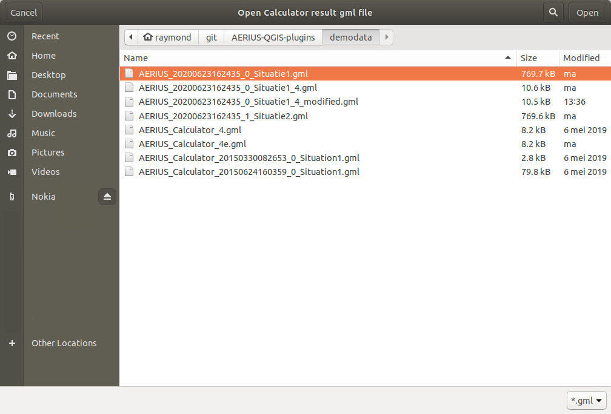
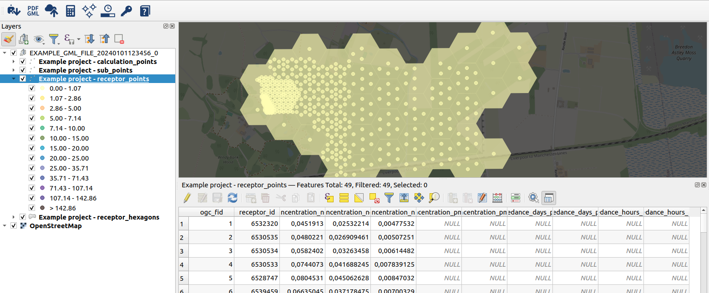
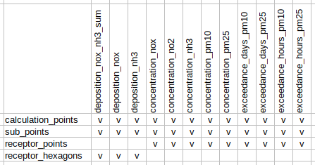

* [Index](index.md)
* [Import Calculator Results](01_import_calc_results.md)
* [Extract GML from AERIUS PDF](03_extract_gml_from_pdf.md)
* [Generate Calculator Input](04_generate_calc_input.md)
* [Relate Calculator results](05_relate_calc_results.md)
* [Connect - Receptor Sets](07_connect_receptor_sets.md)
* [Connect - Jobs](08_connect_jobs.md)
* [Configuration](09_configuration.md)

# Import Calculator results

Import Calculator result .gml files and add the results as QGIS vector layers.

## Howto

Click the import button in the IMAER toolbar and browse to the downloaded IMAER GML file from Aerius Calculator. (Make sure you downloaded the "GML with calculation results".)

The data will be converted into a GeoPackage (.gpkg) file at the same location your GML file is placed. Make sure you have write access to that directory.

After conversion, the calculation results will be opened as vector layer(s) in QGIS. The layers appear in a layer group, which has the name of the imported .gml file. All layers get a style similar to the style used in the web interface.

You can use all standard QGIS functionality for viewing, analysing and editing the data.

## Result layers

An IMAER calculation result .gml file can hold up to 3 different feature types: CalculationPoint, SubPoint and Receptor. Receptor features are split into a point and a polygon (hexagon) layer. Hexagons contain deposition results and points contain concentration results. For convenience, the depositions are summarized in the field `depositions_nox_nh3_sum`.

Layer names:
* <<Situation Name>> - calculation_points
* '<Situation Name>' - sub_points
* [Situation Name] - receptor_points
* `<Situation Name>` - receptor hexagons

## Remarks

* Supported IMAER versions: 6.0.x
