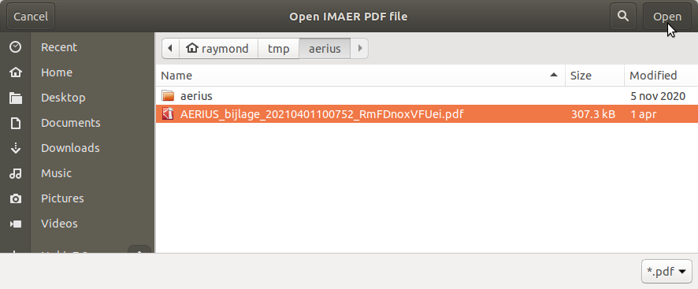

* [Index](index.md)
* [Import Calculator Results](01_import_calc_results.md)
* [Extract GML from AERIUS PDF](03_extract_gml_from_pdf.md)
* [Generate Calculator Input](04_generate_calc_input.md)
* [Relate Calculator results](05_relate_calc_results.md)
* [Connect - Receptor Sets](07_connect_receptor_sets.md)
* [Connect - Jobs](08_connect_jobs.md)
* [Configuration](09_configuration.md)

# Extract GML from AERIUS PDF

## Introduction

AERIUS Calculator provides downloading a PDF file which contains emission sources
in a data block. This function helps you extracting that data from the PDF and save
it to one or more GML files.

## Howto

1. Click the PDF/GML button to open the dialog.
2. Choose the PDF file containing your input data.

After pressing `open`, the plugin will save the extracted data to a GML file with the
same file name with a `_0` postfix and `.gml` as extension. In case there are multiple
GML files present in the PDF, the postfix will be `_1`, `_2` and so on.
A link to the file(s) will be displayed in the message bar on top of your map. If
anything goes wrong, an error will be displayed there.
