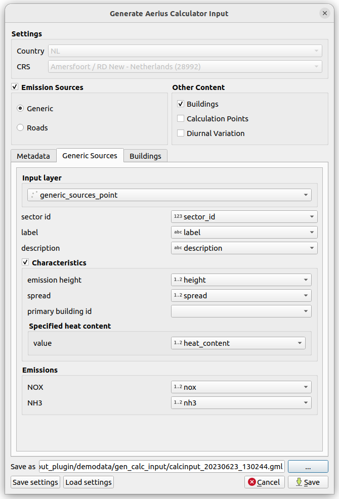
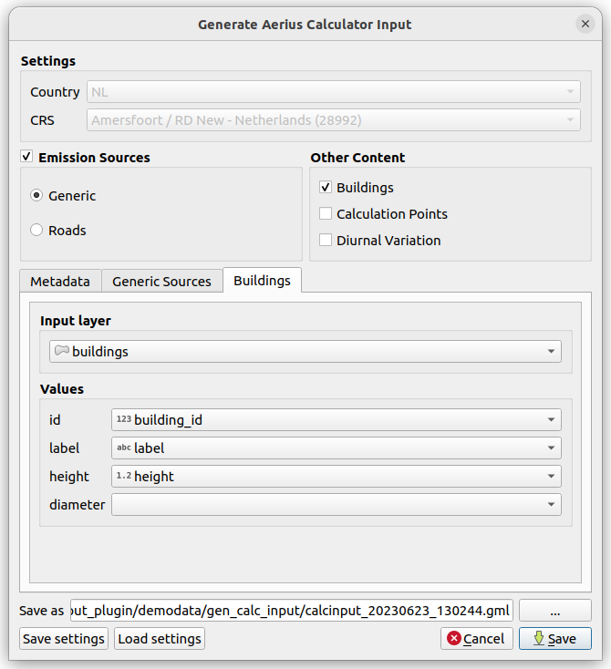
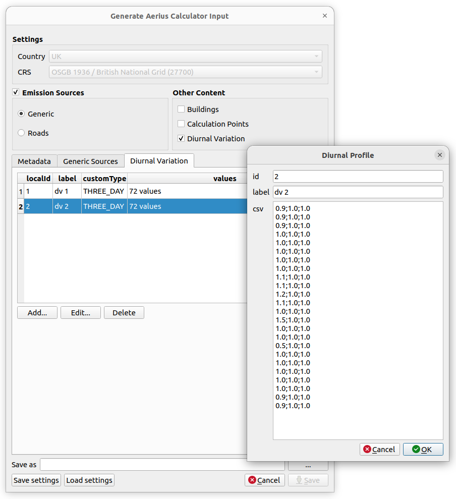
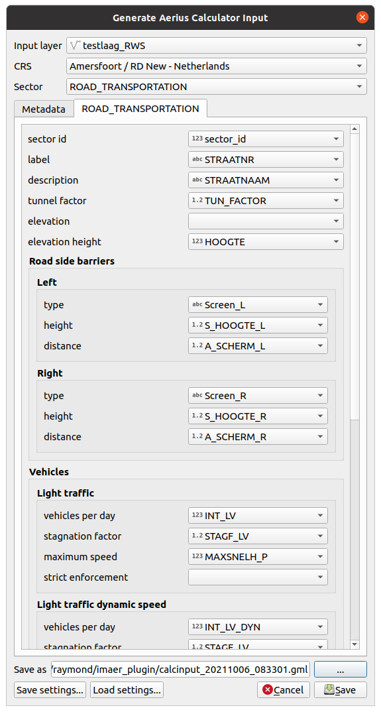

* [Index](index.md)
* [Generate Calculator Input](01_generate_calc_input.md)
* [Import Calculator Results](04_import_calc_results.md)
* [Relate Calculator results](05_relate_calc_results.md)
* [Connect - Receptor Sets](07_connect_receptor_sets.md)
* [Connect - Jobs](08_connect_jobs.md)
* [Configuration](09_configuration.md)


# Generate Calculator Input

Convert your own data into IMAER GML data for use in AERIUS Calculator. This feature can turn data from any type of QGIS vector layer into emission sources, buildings and/or calculation points.

The available fields in the interface are depending on your country setting.

The plugin simply attempts to generate the GML code based on your input data and plugin settings. There is no check for data validity! The easiest way to check validity is using the Calculator website.
In general, leaving a field blank or having NULL values in your data will result in NULL values in the output. For optional parameters, this will simply not output anything. But in case of mandatory data it might result in errors.

## Emission Sources

Open your emission data as a regular vector layer in QGIS. The geometries can be points,
lines or polygons. (And not multi-points, -lines or -polygons.)


1. Make sure your Country and CRS are set to the right values. If not, change them in the plugin configuration dialog.
2. Click the Generate IMAER Calculator input GML button to open the dialog for generating Calculator input GML.
3. Choose the emission source type for your data. Currently only 2 sectors are available, `Roads` and `Generic` (for generic emission sources).
4. In both the Metadata and Emission Source tabs, choose the fields from your layer for every variable you want to store in the GML file.
5. Choose a file name for your GML file. The dialog will suggest a name including the current date and time (like `calcinput_20230623_130244.gml`)



After pressing Save, the GML file will be generated. A link to the file will be displayed in the message bar on top of your map. If anything goes wrong, an error will be displayed there.

## Other Content

You can also generate other information into GML, such as buildings and calculation points.

### Buildings



Buildings can either be created from a (single) polygon layer or a point layer containing
a diameter value (for circular buildings).

The id field should contain the same integer value as used in the emission source pointing to it. The generated GML will automatically contain the right localId values referring to the buildings.

### Calculation Points


Those are typically stand alone GML files to upload to AERIUS Connect for calculating depositions at your personally picked locations. The input must be a point layer.

Only in the UK it's possible to add `road local fraction NO2` and `Entity Reference` values.

### Time Varying Profiles



Diurnal variation profiles are not created from a layer (as there is no geometry needed) but by hand
from a semicolon separated value table.

The three values per hour of the day are for mon-fri ; saturday ; sunday. In total there should be 72 values (24h x 3d). The monthly profile should have 12 values, one for every month. See examples below.

The `id` field should contain the same integer value as used in the emission source pointing to it.

#### CSV Example THREE_DAY

```
1.0;1.0;1.0
1.0;1.0;1.0
1.0;1.0;1.0
1.0;1.0;1.0
1.0;1.0;1.0
1.0;1.0;1.0
1.0;1.0;1.0
1.0;1.0;1.0
1.0;1.0;1.0
1.0;1.0;1.0
1.0;1.0;1.0
1.0;1.0;1.0
1.0;1.0;1.0
1.0;1.0;1.0
1.0;1.0;1.0
1.0;1.0;1.0
1.0;1.0;1.0
1.0;1.0;1.0
1.0;1.0;1.0
1.0;1.0;1.0
1.0;1.0;1.0
1.0;1.0;1.0
1.0;1.0;1.0
1.0;1.0;1.0
```

#### CSV Example MONTHLY

```
1.0
1.0
1.0
1.0
1.0
1.0
1.0
1.0
1.0
1.0
1.0
1.0
```

## Saving and loading settings

Because picking all the fields is a lot of work, there's a way to store the current
field settings in a file. This is done with the `Save settings` and `Load settings` buttons
at the bottom of the dialog.
Loading the settings will set the field names.
* In case the current input layer does not contain that field name, the entry will be cleared.
* Empty values are stored as well.
* The settings are stored in the work directory in a file called `generate_gml_config.json`
which will be overwritten on every save operation.



## Using the exported GML file

There are several ways of using the generated GML.

1. Use the **plugin's Connect** functionality. This can validate the GML content, start a calculation and retreive the results.
2. The generated GML file can be imported using the interface at [Aerius Calculator (NL)](https://calculator.aerius.nl/) for starting the calculation. It is possible
to import multiple files before starting the calculation, which you can use when having
multiple maplayers with emission data (and different geometry types).
3. Use the **AERIUS Connect API** using the [Swagger](https://connect.aerius.nl/) interface or
create your own software to connect to it.

## Remarks

* The current version of the generated GML file is `IMAER 6.0`
* IMAER does not support multi geometry types (like MultiLineString) and will try to
convert your data in case it has a multi type, because single geometry data is often stored as multi geometry type in GIS.
* Your attribute data must contain the exact values that should end up in the GML file. The plugin does not attempt to convert values in some smart way.
