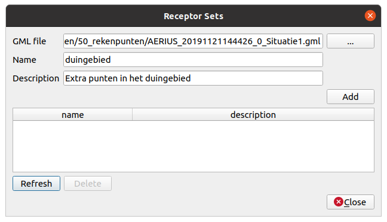
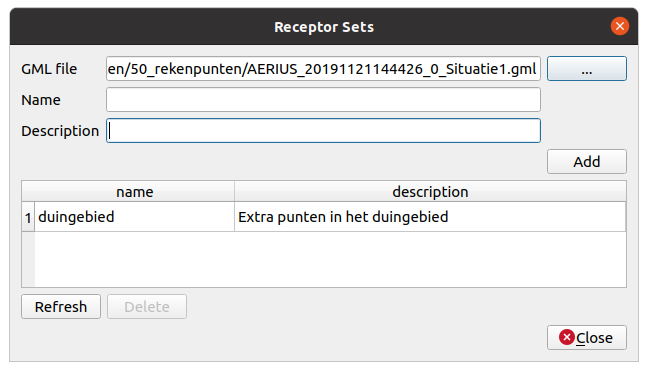
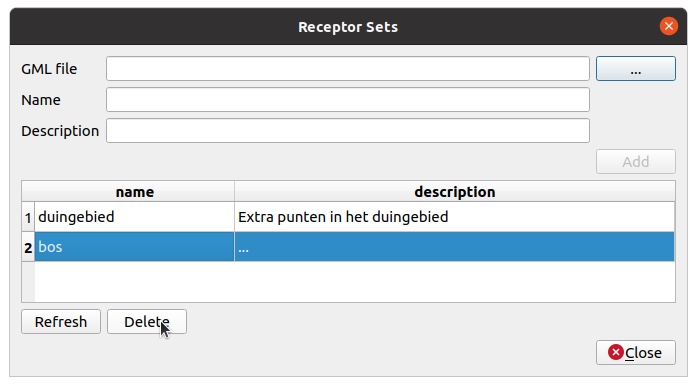

* [Index](index.md)
* [Generate Calculator Input](01_generate_calc_input.md)
* [Import Calculator Results](04_import_calc_results.md)
* [Relate Calculator results](05_relate_calc_results.md)
* [Connect - Receptor Sets](07_connect_receptor_sets.md)
* [Connect - Jobs](08_connect_jobs.md)
* [Configuration](09_configuration.md)

# Connect - Receptor Sets

In this dialog you can manage your own Receptor Sets in Connect. The dialog displays a
list of uploaded data sets.

## Howto

You can add a Receptor Set by uploading a GML file with CalculationPoints and a name to identify them. The GML should contain featureMembers like this:

`    <imaer:featureMember>
        <imaer:CalculationPoint gml:id="CP.1">
            <imaer:identifier>
                <imaer:NEN3610ID>
                    <imaer:namespace>NL.IMAER</imaer:namespace>
                    <imaer:localId>CP.1</imaer:localId>
                </imaer:NEN3610ID>
            </imaer:identifier>
            <imaer:GM_Point>
                <gml:Point srsName="urn:ogc:def:crs:EPSG::28992" gml:id="CP.1.POINT">
                    <gml:pos>123456.0 456789.0</gml:pos>
                </gml:Point>
            </imaer:GM_Point>
            <imaer:label>Bossen &amp; Duinen</imaer:label>
        </imaer:CalculationPoint>
    </imaer:featureMember>`

Unfortunately, the plugin can not (yet) create these kind of files.

### Adding a set

1. Create a GML containing CalculationPoint(s) like this:
2. Choose the GML file.
3. Choose a name and optional description.
4. Click Add to start uploading.

### Removing a set

1. Select the set you want to remove by clicking the line in the table.
2. Click `Delete`.

### Refresh

1. Click the `Refresh` button. :)

After adding and removing Receptor Sets, a refresh should happen automatically. But in
some occasions, like changes on the server or after network problems, you might want
to refresh manually to make sure you are looking at the current data status.

## Remarks

* Make sure to keep a local copy of your GML files, as they get deleted during a server update.
